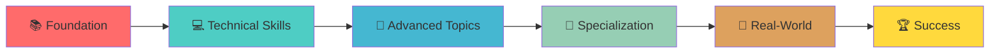
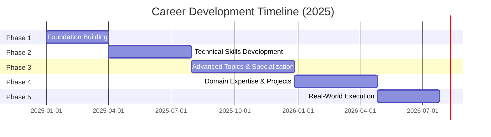
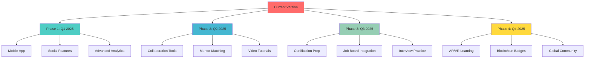

<div align="center">
  
</div>

<div align="center">
  
[](https://git.io/typing-svg)

</div>

<p align="center">
  <a href="#-quick-start"></a>
  <a href="#-features"></a>
  <a href="#-tech-stack"></a>
  <a href="#-screenshots"></a>
  <a href="#-future-roadmap"></a>
</p>

<p align="center">
  
  
  
  
  
</p>

<div align="center">
  
</div>

<br>

## 📋 Table of Contents

<details open>
<summary><b>Click to expand/collapse</b></summary>

- [🎯 Overview](#-overview)
- [✨ Features](#-features)
- [🚀 Quick Start](#-quick-start)
- [🎨 Screenshots](#-screenshots)
- [🛠 Tech Stack](#-tech-stack)
- [📦 Installation](#-installation)
- [🎮 Usage](#-usage)
- [📊 Project Structure](#-project-structure)
- [🗺 Career Roadmap Phases](#-career-roadmap-phases)
- [🤖 AI Integration](#-ai-integration)
- [🌟 Key Highlights](#-key-highlights)
- [🔮 Future Roadmap](#-future-roadmap)
- [🤝 Contributing](#-contributing)
- [👨‍💻 Developer](#-developer)
- [📜 License](#-license)

</details>

<br>

<div align="center">
  
</div>

## 🎯 Overview

<div align="center">
  
  
  
</div>

<br>

**CareerLaunch OS 2025** is your comprehensive career planning and tracking dashboard that transforms the overwhelming journey of career development into a structured, gamified experience. Whether you're a student, professional, or career changer, this platform provides you with:



<br>

### 🎯 What Makes This Special?

<table>
<tr>
<td width="50%" valign="top">

#### 🌟 For Learners
- 📅 **Structured Learning Path**: Follow a proven 5-phase methodology
- ✅ **Progress Tracking**: Visual indicators for every milestone
- 📚 **Resource Library**: Curated materials for each skill
- 🎯 **Goal Setting**: Set and achieve career milestones
- 🏆 **Achievement System**: Gamified progress tracking

</td>
<td width="50%" valign="top">

#### 🚀 For Career Growth
- 📊 **Exam Calendar**: Never miss important dates
- 🤖 **AI Tutor**: Get personalized guidance
- 💼 **Real-world Projects**: Build your portfolio
- 🔄 **Continuous Updates**: Stay current with trends
- 🌐 **Community Driven**: Learn with others

</td>
</tr>
</table>

<div align="center">
  
</div>

## ✨ Features

<div align="center">

### 🎪 Core Features Showcase

</div>

<table>
<tr>
<td width="33%" align="center">
  
  <h3>📊 Interactive Dashboard</h3>
  <p>Beautiful, responsive dashboard with real-time progress visualization and achievement tracking</p>
</td>
<td width="33%" align="center">
  
  <h3>🤖 AI Tutor</h3>
  <p>Powered by Google Gemini AI for personalized learning assistance and career guidance</p>
</td>
<td width="33%" align="center">
  
  <h3>📅 Exam Calendar</h3>
  <p>Comprehensive exam schedule with notifications and preparation tracking</p>
</td>
</tr>
<tr>
<td width="33%" align="center">
  
  <h3>📈 Progress Analytics</h3>
  <p>Detailed analytics and insights into your learning journey with visual charts</p>
</td>
<td width="33%" align="center">
  
  <h3>⚙️ Customizable</h3>
  <p>Tailor the roadmap to your needs with flexible domain and task management</p>
</td>
<td width="33%" align="center">
  
  <h3>💾 Auto-Save</h3>
  <p>Local storage persistence ensures your progress is never lost</p>
</td>
</tr>
</table>

<details>
<summary><b>🎯 Detailed Feature List (Click to expand)</b></summary>

<br>

#### 📚 Learning Management
- ✅ **5 Comprehensive Phases**: From Foundation to Real-World Execution
- ✅ **9 Core Skill Domains**: CS, Development, Data Science, AI/ML, Cloud, DevOps, Security, Math, Soft Skills
- ✅ **Task Breakdown**: Each domain divided into actionable tasks
- ✅ **Progress Checkboxes**: Mark tasks as complete
- ✅ **Visual Progress Bars**: See your advancement at a glance

#### 🎨 User Experience
- ✅ **Modern UI/UX**: Clean, intuitive interface with smooth animations
- ✅ **Dark Mode Ready**: Eye-friendly design for extended use
- ✅ **Responsive Design**: Works flawlessly on desktop, tablet, and mobile
- ✅ **Smooth Transitions**: Delightful interactions and animations
- ✅ **Icon Integration**: Lucide React icons for visual clarity

#### 🤖 AI Features
- ✅ **Intelligent Chat**: Context-aware AI assistant
- ✅ **Learning Recommendations**: Personalized study suggestions
- ✅ **Doubt Resolution**: Get answers to your questions
- ✅ **Resource Suggestions**: AI-curated learning materials
- ✅ **Progress Analysis**: AI-driven insights into your learning

#### 📊 Analytics & Tracking
- ✅ **Domain Completion Rate**: Track progress per skill area
- ✅ **Overall Progress**: Global view of your journey
- ✅ **Time Tracking**: Monitor time spent on each domain
- ✅ **Streak Counter**: Build and maintain learning habits
- ✅ **Achievement Badges**: Unlock rewards for milestones

#### 🔧 Technical Features
- ✅ **Local Storage**: Automatic data persistence
- ✅ **Export/Import**: Backup and restore your progress
- ✅ **Fast Load Times**: Optimized performance with Vite
- ✅ **TypeScript**: Type-safe codebase
- ✅ **Component Architecture**: Modular, maintainable code

</details>

<div align="center">
  
</div>

## 🚀 Quick Start

Get up and running in less than 2 minutes! ⚡

```bash
# 1️⃣ Clone the repository
git clone https://github.com/PIYUSH0-7/CAREER07.git

# 2️⃣ Navigate to project directory
cd CAREER07

# 3️⃣ Install dependencies
npm install

# 4️⃣ Start development server
npm run dev

# 🎉 Open http://localhost:5173 in your browser!
```

<div align="center">
  
</div>

<div align="center">
  
</div>

## 🎨 Screenshots

<div align="center">

> **Note**: Screenshots coming soon! Run the application locally to see the beautiful interface in action.

### ✨ What You'll See:

<table>
<tr>
<td width="33%" align="center">
  
  <h4>📊 Dashboard</h4>
  <p>Beautiful overview of all 5 career phases with visual progress tracking</p>
</td>
<td width="33%" align="center">
  
  <h4>✅ Task Tracker</h4>
  <p>Detailed view of each domain with interactive task checkboxes</p>
</td>
<td width="33%" align="center">
  
  <h4>💬 AI Tutor</h4>
  <p>Intelligent chat interface with personalized learning guidance</p>
</td>
</tr>
<tr>
<td width="33%" align="center">
  
  <h4>📅 Exam Calendar</h4>
  <p>Never miss important dates with comprehensive exam schedule</p>
</td>
<td width="33%" align="center">
  
  <h4>📈 Analytics</h4>
  <p>Detailed insights into your learning progress and achievements</p>
</td>
<td width="33%" align="center">
  
  <h4>📱 Responsive</h4>
  <p>Seamlessly works across desktop, tablet, and mobile devices</p>
</td>
</tr>
</table>

### 🚀 Try It Yourself!

```bash
npm install && npm run dev
```

Then open `http://localhost:5173` to see the interface in action!

</div>

<div align="center">
  
</div>

## 🛠 Tech Stack

<div align="center">

### ⚛️ Frontend Technologies

<table>
<tr>
<td align="center" width="96">

<br>React 19
</td>
<td align="center" width="96">

<br>TypeScript
</td>
<td align="center" width="96">

<br>Vite
</td>
<td align="center" width="96">

<br>HTML5
</td>
<td align="center" width="96">

<br>CSS3
</td>
</tr>
</table>

### 🚀 Build & Dev Tools

<table>
<tr>
<td align="center" width="96">

<br>npm
</td>
<td align="center" width="96">

<br>Node.js
</td>
<td align="center" width="96">

<br>Git
</td>
<td align="center" width="96">

<br>GitHub
</td>
<td align="center" width="96">

<br>VS Code
</td>
</tr>
</table>

### 🤖 AI & Services

<table>
<tr>
<td align="center" width="150">

<br>Google Gemini AI
</td>
<td align="center" width="150">

<br>Vercel (Hosting)
</td>
</tr>
</table>

</div>

### 📦 Key Dependencies

```json
{
  "react": "^19.2.1",
  "react-dom": "^19.2.1",
  "typescript": "~5.8.2",
  "vite": "^6.2.0",
  "lucide-react": "^0.556.0",
  "@google/genai": "^1.31.0"
}
```

<div align="center">
  
</div>

## 📦 Installation

<details open>
<summary><b>📝 Prerequisites</b></summary>

<br>

Before you begin, ensure you have the following installed:

- **Node.js** (v18 or higher) - [Download](https://nodejs.org/)
- **npm** (comes with Node.js) or **yarn**
- **Git** - [Download](https://git-scm.com/)
- A modern web browser (Chrome, Firefox, Safari, or Edge)

</details>

<details>
<summary><b>🔧 Step-by-Step Installation</b></summary>

<br>

### 1️⃣ Clone the Repository

```bash
git clone https://github.com/PIYUSH0-7/CAREER07.git
cd CAREER07
```

### 2️⃣ Install Dependencies

```bash
npm install
# or
yarn install
```

### 3️⃣ Environment Setup (Optional)

Create a `.env` file in the root directory for AI features:

```env
VITE_GEMINI_API_KEY=your_gemini_api_key_here
```

### 4️⃣ Start Development Server

```bash
npm run dev
# or
yarn dev
```

### 5️⃣ Build for Production

```bash
npm run build
# or
yarn build
```

### 6️⃣ Preview Production Build

```bash
npm run preview
# or
yarn preview
```

</details>

<div align="center">
  
</div>

## 🎮 Usage

<div align="center">

### 🎯 Getting Started with CareerLaunch OS

</div>

<table>
<tr>
<td width="50%">

#### 1️⃣ **Explore the Dashboard**
- View all 5 career phases
- Check your overall progress
- Browse the exam calendar
- Access the AI tutor

</td>
<td width="50%">

#### 2️⃣ **Select a Domain**
- Click on any skill domain
- View detailed tasks and subtasks
- Track your progress per section
- Mark completed items

</td>
</tr>
<tr>
<td width="50%">

#### 3️⃣ **Track Your Progress**
- Check off completed tasks
- Watch your progress bars fill up
- Unlock achievements
- Build learning streaks

</td>
<td width="50%">

#### 4️⃣ **Use AI Assistance**
- Ask questions to the AI tutor
- Get personalized recommendations
- Clarify doubts instantly
- Receive study guidance

</td>
</tr>
</table>

<details>
<summary><b>💡 Pro Tips for Maximum Productivity</b></summary>

<br>

- ✅ **Start with Phase 1**: Build a strong foundation before advancing
- 🎯 **Set Daily Goals**: Aim to complete 2-3 tasks per day
- 📅 **Use the Calendar**: Plan your study schedule around exam dates
- 🤖 **Leverage AI**: Don't hesitate to ask questions
- 📊 **Review Progress**: Check your analytics weekly
- 🔄 **Stay Consistent**: Regular small steps beat sporadic efforts
- 💾 **Backup Data**: Export your progress periodically
- 🌟 **Join Community**: Share progress and learn from others

</details>

<div align="center">
  
</div>

## 📊 Project Structure

```
CAREER07/
┣ 📂 components/
┃ ┣ 📜 Layout.tsx              # Main layout wrapper
┃ ┣ 📜 Dashboard.tsx           # Main dashboard component
┃ ┗ 📜 DomainTracker.tsx       # Domain detail view
┣ 📂 services/
┃ ┗ 📜 aiService.ts            # Google Gemini AI integration
┣ 📜 App.tsx                   # Root application component
┣ 📜 data.ts                   # Career roadmap data structure
┣ 📜 types.ts                  # TypeScript type definitions
┣ 📜 index.tsx                 # Application entry point
┣ 📜 index.html                # HTML template
┣ 📜 vite.config.ts            # Vite configuration
┣ 📜 tsconfig.json             # TypeScript configuration
┣ 📜 package.json              # Dependencies and scripts
┣ 📜 metadata.json             # Project metadata
┗ 📜 README.md                 # This file!
```

<div align="center">
  
</div>

## 🗺 Career Roadmap Phases

<div align="center">

### 📚 The Complete Journey

</div>



<details open>
<summary><b>🎯 Phase Breakdown</b></summary>

<br>

### 📗 Phase 1: Foundation Building (Months 1-3)
<table>
<tr>
<td width="30%"><b>Focus Areas</b></td>
<td width="70%">
• Computer Science Fundamentals<br>
• Programming Basics<br>
• Problem Solving<br>
• Math Foundations
</td>
</tr>
<tr>
<td><b>Key Skills</b></td>
<td>Data Structures, Algorithms, Basic Programming, Mathematics</td>
</tr>
<tr>
<td><b>Outcome</b></td>
<td>Strong foundational knowledge ready for advanced topics</td>
</tr>
</table>

### 📘 Phase 2: Technical Skills Development (Months 4-7)
<table>
<tr>
<td width="30%"><b>Focus Areas</b></td>
<td width="70%">
• Web Development<br>
• Backend Development<br>
• Database Management<br>
• Version Control
</td>
</tr>
<tr>
<td><b>Key Skills</b></td>
<td>React, Node.js, Express, MongoDB, Git, REST APIs</td>
</tr>
<tr>
<td><b>Outcome</b></td>
<td>Ability to build full-stack applications independently</td>
</tr>
</table>

### 📙 Phase 3: Advanced Topics & Specialization (Months 8-12)
<table>
<tr>
<td width="30%"><b>Focus Areas</b></td>
<td width="70%">
• Data Science & Analytics<br>
• Machine Learning<br>
• AI Fundamentals<br>
• Cloud Computing
</td>
</tr>
<tr>
<td><b>Key Skills</b></td>
<td>Python, TensorFlow, AWS/Azure, Data Analysis, ML Models</td>
</tr>
<tr>
<td><b>Outcome</b></td>
<td>Specialized knowledge in cutting-edge technologies</td>
</tr>
</table>

### 📕 Phase 4: Domain Expertise & Projects (Months 13-16)
<table>
<tr>
<td width="30%"><b>Focus Areas</b></td>
<td width="70%">
• DevOps & CI/CD<br>
• Cybersecurity<br>
• System Design<br>
• Portfolio Building
</td>
</tr>
<tr>
<td><b>Key Skills</b></td>
<td>Docker, Kubernetes, Security Practices, Architecture Design</td>
</tr>
<tr>
<td><b>Outcome</b></td>
<td>Production-ready skills with impressive portfolio</td>
</tr>
</table>

### 📔 Phase 5: Real-World Execution (Months 17-20)
<table>
<tr>
<td width="30%"><b>Focus Areas</b></td>
<td width="70%">
• Capstone Projects<br>
• Interview Preparation<br>
• Professional Networking<br>
• Career Launch
</td>
</tr>
<tr>
<td><b>Key Skills</b></td>
<td>System Design, Behavioral Interviews, Communication, Leadership</td>
</tr>
<tr>
<td><b>Outcome</b></td>
<td>Job-ready professional with complete skill set</td>
</tr>
</table>

</details>

<div align="center">
  
</div>

## 🤖 AI Integration

<div align="center">
  
</div>

<br>

The AI Tutor is powered by **Google's Gemini AI**, providing intelligent, context-aware assistance throughout your learning journey.

### 🎯 AI Capabilities

<table>
<tr>
<td width="50%" valign="top">

#### 💬 Conversational Learning
- Natural language understanding
- Context-aware responses
- Follow-up question handling
- Personalized explanations

#### 📚 Study Assistance
- Concept clarification
- Resource recommendations
- Learning path suggestions
- Progress analysis

</td>
<td width="50%" valign="top">

#### 🎓 Career Guidance
- Skill gap analysis
- Career path recommendations
- Interview preparation tips
- Industry insights

#### 🔧 Technical Support
- Code explanation
- Debugging assistance
- Best practices guidance
- Technology comparisons

</td>
</tr>
</table>

### 🚀 Getting Your API Key

1. Visit [Google AI Studio](https://makersuite.google.com/app/apikey)
2. Sign in with your Google account
3. Create a new API key
4. Add it to your `.env` file as `VITE_GEMINI_API_KEY`

<div align="center">
  
</div>

## 🌟 Key Highlights

<div align="center">

### 🏆 What Sets Us Apart

</div>

<table>
<tr>
<td align="center" width="25%">
  
  <h4>📚 Comprehensive</h4>
  <sub>9 skill domains covering every aspect of modern tech careers</sub>
</td>
<td align="center" width="25%">
  
  <h4>🛤 Structured</h4>
  <sub>Clear 5-phase progression from beginner to expert</sub>
</td>
<td align="center" width="25%">
  
  <h4>🤖 AI-Powered</h4>
  <sub>Intelligent tutor available 24/7 for guidance</sub>
</td>
<td align="center" width="25%">
  
  <h4>⚡ Fast</h4>
  <sub>Lightning-fast performance with modern tech stack</sub>
</td>
</tr>
<tr>
<td align="center">
  
  <h4>🎨 Beautiful</h4>
  <sub>Modern, intuitive UI that's a joy to use</sub>
</td>
<td align="center">
  
  <h4>💾 Persistent</h4>
  <sub>Your progress is automatically saved locally</sub>
</td>
<td align="center">
  
  <h4>🔓 Open Source</h4>
  <sub>Free to use, modify, and contribute to</sub>
</td>
<td align="center">
  
  <h4>👥 Community</h4>
  <sub>Join hundreds learning and growing together</sub>
</td>
</tr>
</table>

### 📊 By The Numbers

<div align="center">

| 🎯 Metric | 📈 Count | 🌟 Description |
|-----------|----------|----------------|
| **Phases** | 5 | Structured learning progression |
| **Domains** | 9 | Core skill areas covered |
| **Tasks** | 200+ | Actionable learning items |
| **Resources** | 500+ | Curated learning materials |
| **Exams** | 50+ | Important dates tracked |
| **AI Responses** | ∞ | Unlimited tutor access |

</div>

<div align="center">
  
</div>

## 🔮 Future Roadmap

<div align="center">

### 🚀 Upcoming Features & Enhancements

</div>



<details>
<summary><b>📅 Detailed Roadmap (Click to expand)</b></summary>

<br>

### 🎯 Q1 2025 - Foundation Enhancement
- [ ] **Mobile Application** - Native iOS and Android apps
- [ ] **Social Features** - Connect with other learners
- [ ] **Advanced Analytics** - Detailed progress insights
- [ ] **Dark/Light Theme Toggle** - User preference support
- [ ] **Export Progress** - PDF reports and certificates
- [ ] **Notification System** - Reminders and updates

### 🎯 Q2 2025 - Collaboration & Community
- [ ] **Collaboration Tools** - Study groups and team projects
- [ ] **Mentor Matching** - Connect with industry professionals
- [ ] **Video Tutorials** - Integrated learning content
- [ ] **Discussion Forums** - Community Q&A platform
- [ ] **Live Coding Sessions** - Real-time learning events
- [ ] **Peer Review System** - Get feedback on projects

### 🎯 Q3 2025 - Career Acceleration
- [ ] **Certification Preparation** - Exam-specific study paths
- [ ] **Job Board Integration** - Career opportunities feed
- [ ] **Interview Practice** - Mock interviews with AI
- [ ] **Resume Builder** - ATS-optimized resume creation
- [ ] **Portfolio Generator** - Showcase your projects
- [ ] **Salary Insights** - Market rate information

### 🎯 Q4 2025 - Innovation & Scale
- [ ] **AR/VR Learning** - Immersive learning experiences
- [ ] **Blockchain Badges** - Verified skill credentials
- [ ] **Global Community** - Multi-language support
- [ ] **API Access** - Third-party integrations
- [ ] **White Label Solution** - For educational institutions
- [ ] **Enterprise Version** - Team and organization features

</details>

<div align="center">
  
  
  
  
  
</div>

<div align="center">
  
</div>

## 🤝 Contributing

<div align="center">

### 🌟 We Love Contributions!


</div>

Your contributions make this project better! Whether you're fixing bugs, adding features, or improving documentation, we appreciate your help.

<details open>
<summary><b>🎯 How to Contribute</b></summary>

<br>

### 1️⃣ Fork the Repository

Click the "Fork" button at the top right of this repository.

### 2️⃣ Clone Your Fork

```bash
git clone https://github.com/YOUR_USERNAME/CAREER07.git
cd CAREER07
```

### 3️⃣ Create a Branch

```bash
git checkout -b feature/your-feature-name
```

### 4️⃣ Make Your Changes

- Follow the existing code style
- Add tests if applicable
- Update documentation as needed
- Ensure your code works properly

### 5️⃣ Commit Your Changes

```bash
git add .
git commit -m "feat: add amazing feature"
```

**Commit Message Guidelines:**
- `feat:` New feature
- `fix:` Bug fix
- `docs:` Documentation changes
- `style:` Code style changes (formatting, etc.)
- `refactor:` Code refactoring
- `test:` Adding tests
- `chore:` Maintenance tasks

### 6️⃣ Push to Your Fork

```bash
git push origin feature/your-feature-name
```

### 7️⃣ Create a Pull Request

Go to the original repository and click "New Pull Request"

</details>

<details>
<summary><b>📝 Contribution Guidelines</b></summary>

<br>

### ✅ DO
- ✅ Write clear, concise commit messages
- ✅ Follow the existing code style
- ✅ Add comments for complex logic
- ✅ Update documentation when needed
- ✅ Test your changes thoroughly
- ✅ Keep PRs focused on a single feature/fix
- ✅ Be respectful and constructive

### ❌ DON'T
- ❌ Submit large, unfocused PRs
- ❌ Break existing functionality
- ❌ Ignore code style guidelines
- ❌ Skip testing your changes
- ❌ Leave commented-out code
- ❌ Introduce security vulnerabilities

</details>

<details>
<summary><b>🐛 Reporting Bugs</b></summary>

<br>

Found a bug? Help us fix it!

1. **Check existing issues** to avoid duplicates
2. **Create a new issue** with the bug label
3. **Provide details:**
   - Description of the bug
   - Steps to reproduce
   - Expected vs actual behavior
   - Screenshots if applicable
   - Your environment (OS, browser, etc.)

</details>

<details>
<summary><b>💡 Suggesting Features</b></summary>

<br>

Have an idea? We'd love to hear it!

1. **Check the roadmap** to see if it's planned
2. **Create a new issue** with the enhancement label
3. **Describe your idea:**
   - What problem does it solve?
   - How would it work?
   - Any implementation ideas?
   - Mockups or examples (optional)

</details>

<div align="center">

### 🌟 Contributors

Thanks to all the amazing people who have contributed! ❤️

<a href="https://github.com/PIYUSH0-7/CAREER07/graphs/contributors">
  
</a>

</div>

<div align="center">
  
</div>

## 👨‍💻 Developer

<div align="center">

### 🚀 Created by Piyush Gangwar


</div>

<br>

<table>
<tr>
<td width="50%" valign="top">

#### 📫 Connect With Me

<div align="center">

[](https://github.com/PIYUSH0-7)
[](https://www.linkedin.com/in/piyush070/)
[](https://piyush07-pi.vercel.app/)
[](https://dev-path-tracker.vercel.app/)

</div>

</td>
<td width="50%" valign="top">

#### 💼 About Me

```typescript
const piyush = {
  role: "Full Stack Developer",
  focus: ["Web Dev", "AI/ML", "Automation"],
  currentProject: "CareerLaunch OS 2025",
  learning: ["System Design", "Cloud Architecture"],
  hobbies: ["Coding", "Teaching", "Open Source"]
};
```

</td>
</tr>
</table>

<div align="center">

### 📊 GitHub Stats


### 🏆 GitHub Trophies


### 🐍 Contribution Graph

<picture>
  <source media="(prefers-color-scheme: dark)" srcset="https://raw.githubusercontent.com/PIYUSH0-7/PIYUSH0-7/output/github-contribution-grid-snake-dark.svg">
  <source media="(prefers-color-scheme: light)" srcset="https://raw.githubusercontent.com/PIYUSH0-7/PIYUSH0-7/output/github-contribution-grid-snake.svg">
  
</picture>

</div>

<div align="center">
  
</div>

## 📜 License

<div align="center">

This project is licensed under the **MIT License** - see the [LICENSE](LICENSE) file for details.

[](https://opensource.org/licenses/MIT)

### 📝 What This Means

✅ **Commercial use** - Use it in your business  
✅ **Modification** - Change it as you need  
✅ **Distribution** - Share it with others  
✅ **Private use** - Use it privately  
✅ **Patent use** - Use any patents that come with it  

⚠️ **Liability** - No warranty is provided  
⚠️ **Trademark use** - You can't use trademarks  

</div>

<div align="center">
  
</div>

<div align="center">

## 🌟 Show Your Support

<br>

### If this project helped you, give it a ⭐️!

<br>


<br><br>

[](https://star-history.com/#PIYUSH0-7/CAREER07&Date)

<br>

### 📢 Share This Project

Share CareerLaunch OS with your network and help others in their career journey!

[](https://twitter.com/intent/tweet?text=Check%20out%20this%20amazing%20career%20roadmap%20dashboard!%20%F0%9F%9A%80&url=https://github.com/PIYUSH0-7/CAREER07)
[](https://www.linkedin.com/sharing/share-offsite/?url=https://github.com/PIYUSH0-7/CAREER07)
[](https://www.facebook.com/sharer/sharer.php?u=https://github.com/PIYUSH0-7/CAREER07)
[](https://reddit.com/submit?url=https://github.com/PIYUSH0-7/CAREER07&title=CareerLaunch%20OS%202025)

</div>

<br>

<div align="center">
  
</div>

<div align="center">
  
</div>

<br>

<div align="center">
  <b>🚀 "Your career journey starts with a single step. Let's make it count!" 🚀</b><br><br>
  <b>💡 Built with ❤️ by <a href="https://github.com/PIYUSH0-7">Piyush Gangwar</a> | Powered by ☕ & 💻</b><br><br>
  <sub>⭐️ If CareerLaunch OS helped you, please consider starring the repository! ⭐️</sub>
</div>

<br>

<div align="center">
  
</div>

---

<div align="center">
  <sub>Made with 💙 in India 🇮🇳 | Last Updated: December 2024</sub>
</div>

